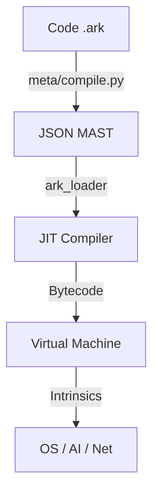

# The Ark-1 Programmer's Field Manual

**Version:** 1.0 (Ouroboros Edition)
**Architect:** Mohamad Al-Zawahreh (Sovereign Systems)
**Status:** PROTOTYPE / ACTIVE

---

## 🌌 Introduction

**Ark** is a Neuro-Symbolic programming language designed for the Sovereign Individual. It offers a **Deterministic Core** (Rust) bridged to an **Infinite Mind** (AI).

### The Philosophy
1.  **Kinetic Syntax:** Code flows from Left to Right. Assignments are explicit actions (`:=`).
2.  **Safety via Values:** Structures are passed by value (cloned) by default in the VM, preventing shared mutable state issues.
3.  **Neuro-Symbolic:** The runtime has direct access to AI models (`intrinsic_ask_ai`), allowing code to "think" while remaining verifiable.

---

## 🛠️ Installation

Ark is currently distributed as a source-available prototype. You need **Python 3.10+** and **Rust (Cargo)**.

### Prerequisites
1.  **Rust**: [Install Rust](https://rustup.rs/)
2.  **Python**: Ensure `python3` and `pip` are installed.
3.  **Dependencies**:
    ```bash
    pip install lark
    ```

### Cloning & Building (Assuming you forked the library otherwise clone directly from here)
```bash
git clone https://github.com/your-repo/ark-0-zheng.git
cd ark-0-zheng
```

To verify your installation, run the "Hello World" example:
```bash
# 1. Compile Ark Source to JSON MAST (Merkle-ized AST)
python3 meta/compile.py apps/hello.ark hello.json

# 2. Run the MAST using the Rust Loader
cd core
cargo run --bin ark_loader -- ../hello.json
```

---

## ⚡ Basic Syntax

### Variables
Ark uses `:=` for assignment.

```ark
x := 10
name := "Sovereign"
is_active := true
```

### Primitives
- **Integer**: 64-bit signed integers (`10`, `-5`).
- **String**: UTF-8 strings (`"Hello"`).
- **Boolean**: `true` or `false`.
- **Unit**: The empty value (returned by void functions).

### Arithmetic & Logic
Standard operators work as expected:
```ark
sum := 10 + 20
diff := 50 - sum
prod := 2 * 3
quot := 10 / 2
is_equal := 10 == 10
check := (10 > 5) && (2 < 4)
```

---

## 🔄 Control Flow

### If / Else
```ark
power := 9001
if power > 9000 {
    print("It's over 9000!")
} else {
    print("Weak.")
}
```

### While Loop
```ark
count := 5
while count > 0 {
    print(count)
    count := count - 1
}
```

---

## 📦 Ownership & Semantics

Ark uses **Pass-by-Value** (Copy) semantics in the VM.

### Assigning & Copying
When you assign a variable or pass it to a function, a **Copy** is made.
```ark
s := { x: 10 }
s2 := s
// 's2' is a clone of 's'. Modifying 's2' does NOT affect 's'.
```

### Field Access
Reading a field (`p.x`) loads a copy of the object and extracts the field. The original object remains valid.
```ark
p := { x: 10, y: 20 }
val := p.x
// 'p' is still valid.
```

### Modifying Fields
To update a field, use assignment to the field path.
```ark
p := { x: 10, y: 20 }
p.x := 99
print(p)   // { x: 99, y: 20 }
```

---

## 🏗️ Data Structures

### Lists
Lists are dynamic arrays.
```ark
l := [1, 2, 3]
l2 := [4, 5]
```

**Note:** List indexing (`l[0]`) is currently mapped to `sys.list.get` which returns `[value, list]`. This is a legacy artifact of linear typing experiments.
*Recommendation: Use destructuring or built-in iterators when available.*

### Structs
Structs are key-value maps (HashMaps).
```ark
user := {
    name: "Neo",
    id: 101
}
```

---

## 🔧 Functions

Define functions with `func`. Arguments are passed by value.

```ark
func add(a, b) {
    return a + b
}

res := add(10, 20)
```

**Recursion:** Supported (e.g. Factorial).

---

## 🧠 Intrinsics (Standard Library)

Ark provides powerful built-in functions.

| Function | Description |
| :--- | :--- |
| `print(...)` | Prints values to stdout. |
| `sys.len(seq)` | Returns `[length, seq]`. |
| `sys.exec(cmd)` | Executes a shell command (Security Warning!). |
| `sys.fs.write(path, data)` | Writes string to file. |
| `sys.fs.read(path)` | Reads string from file. |
| `sys.list.append(list, item)` | Appends item, returns new list. |
| `intrinsic_ask_ai(prompt)` | Queries Gemini AI (requires `GOOGLE_API_KEY`). |

---

## 🏛️ Architecture



---

## 🎓 Complete Example

```ark
print("Starting Ark System...")

// 1. Define Data
config := {
    version: 1,
    mode: "secure"
}

// 2. Logic
if config.mode == "secure" {
    print("Security Active")
}

// 3. Modification
config.version := 2
print("Upgraded to Version:")
print(config)

// 4. Function Call
func double(n) {
    return n * 2
}

result := double(10)
print(result)
```

---

**© 2026 Sovereign Systems**
