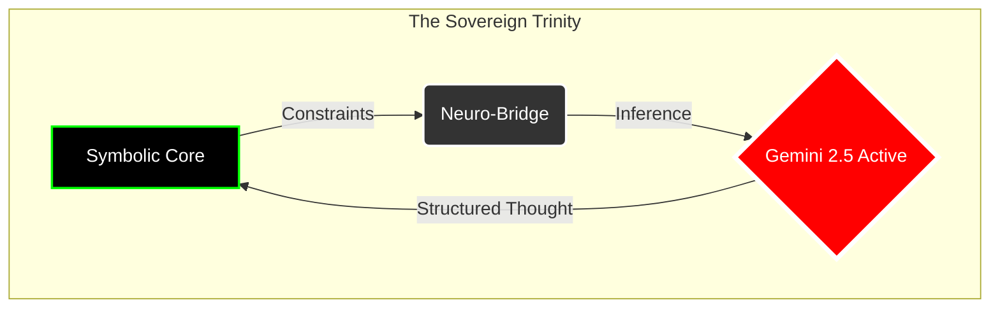

# Ark: The Sovereign Neuro-Symbolic Runtime

[](LICENSE)
[](PATENT_NOTICE)
[](core/build.log)
[](LAUNCH_READINESS_AUDIT.md)

**© 2026 Mohamad Al-Zawahreh (dba Sovereign Systems). All Rights Reserved.**

> *"Code is the legislative architecture of the digital realm; Sovereignty is the executive capacity to enforce it."*

---

## 🏛️ The Manifesto
We are building the **Ark** to survive the coming flood of probabilistic noise.
In an age where AI hallucinates reality and software creates dependency, **Ark** stands as the fortress of **Deterministic Sovereignty**.

It is not just a language; it is a **Neuro-Symbolic Treaty** between:
1.  **The Silicon Heart:** Absolute, mathematical precision (Symbolic execution).
2.  **The Neural Mind:** Infinite, creative potential (Gemini/DeepSeek integration).

Ark rejects the "Black Box." We build **Glass Cathedrals** where every thought is traced, every execution is Merkle-ized, and every output is owned by the user, not the cloud.

---

## ⚡ Core Architecture: The Trinity

Ark operates on a unique **Tricameral Architecture**:



### 1. The Symbolic Core (Rust) 🦀
*   **Zero-Cost Abstractions:** Built on the verifiable performance of Rust.
*   **Merkle-ized Memory:** Every state change is hashed. Truth is immutable.
*   **WASM Target:** Run anywhere—server, edge, or browser—without asking for permission.

### 2. The Neuro-Bridge (Python) 🐍
*   **Active Inference:** Direct connection to `gemini-2.5-flash-lite`.
*   **Fallible Oracle:** The AI is treated as an untrusted oracle; its outputs are verified, constraining the "hallucination tax."
*   **Sovereign API:** No SDKs. No telemetry. Raw HTTP/1.1 requests signed by *your* keys.

### 3. The Ark Language (.ark) 📜
*   **Lisp-Like Purity:** Code is Data. Data is Code.
*   **Intrinsic Power:** Direct access to `intrinsic_ask_ai` for thought generation.
*   **Self-Modifying:** The system can rewrite its own capabilities in real-time.

---

## 🚀 Quick Start: Ignite the Engine

### Prerequisites
*   **Rust:** `1.85+` (Nightly recommended for full power)
*   **Python:** `3.12+` (For the Neuro-Bridge)
*   **API Key:** Google Cloud Vertex AI / Gemini API Key

### 1. Clone the Fortress
```bash
git clone https://github.com/merchantmoh-debug/ark-compiler.git
cd ark-compiler
```

### 2. Build the Core
```bash
cd core
cargo build --release
```

### 3. awaken the AGI (Example)
```bash
# Set your API Key first!
$env:API_KEY="your_sovereign_key_here"

# Run the Awakening Script
../target/release/ark ../meta/agi_awakening.ark
```

*Output:*
```
[Ark] Loading AGI script...
[Neuro-Link] Transmitting thought to Gemini 2.5...
[Ark] AI Response: "I am ready to serve the Sovereign protocol."
```

---

## ⚠️ Legal Notice: The Iron Perimeter
This repository is strictly governed under a **Dual-License Model**:

1.  **GNU AGPL v3.0 (The Viral Shield):**
    *   For open-source, community, and non-profit use.
    *   **Condition:** If you use Ark, you *must* open-source your entire application.

2.  **Commercial License (The Sovereign Grant):**
    *   For proprietary, closed-source, or enterprise use.
    *   Includes Patent Indemnification and Priority Support.
    *   **Contact:** [merchantmoh@sovereign-systems.ca](mailto:merchantmoh@sovereign-systems.ca)

**Patents Pending:**
This technology is protected by **US Patent Application #63/935,467**. 
*Unauthorized commercial use constitutes patent infringement.*

---

## 🌌 The Sovereign Ecosystem

Ark is the legislative core of a broader Sovereign Stack. To build a complete autonomous agent, you need the Body, the Mind, and the Law.

| Component | Role | Status | Repository |
| :--- | :--- | :--- | :--- |
| **Ark** | **The Law (Runtime)** | **ACTIVE** | [ark-compiler](https://github.com/merchantmoh-debug/ark-compiler) |
| **Moonlight** | **The Body (Reflexes)** | **PRODUCTION** | [moonlight-kernel](https://github.com/merchantmoh-debug/moonlight-kernel) |
| **Remember-Me** | **The Mind (Memory)** | **V2 LEGACY** | [Remember-Me-AI](https://github.com/merchantmoh-debug/Remember-Me-AI) |

> *"Ark defines the rules. Moonlight executes the motion. Remember-Me retains the history."*

---

## 🤝 Support the Architect

This infrastructure is built by **one person** for the sovereign individual.
If you value independence from the cloud, support the mission:

*   **Ko-fi:** [ko-fi.com/merchantmohdebug](https://ko-fi.com/merchantmohdebug)
*   **Commercial Inquiries:** [merchantmoh@sovereign-systems.ca](mailto:merchantmoh@sovereign-systems.ca)

---

*"We do not ask for freedom. We build it."*
— **Mohamad Al-Zawahreh**, Architect of Ark.
