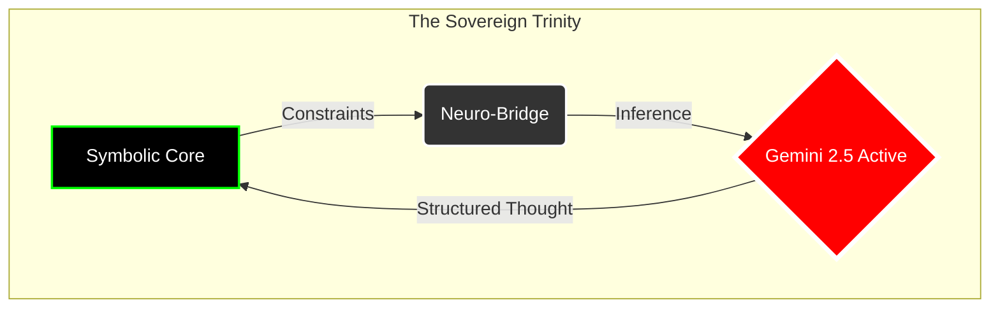

# Ark: The Sovereign Neuro-Symbolic Runtime

[](LICENSE)
[](PATENT_NOTICE)
[](core/build.log)
[](LAUNCH_READINESS_AUDIT.md)

**© 2026 Mohamad Al-Zawahreh (dba Sovereign Systems). All Rights Reserved.**

> *"Code is the legislative architecture of the digital realm; Sovereignty is the executive capacity to enforce it."*

---

## 🚦 Status Interface

| Component | Version | Status | Access |
| :--- | :--- | :--- | :--- |
| **Ark Core (.rs)** | **v1.0.0** | **STABLE** | [Open Source (AGPLv3)](./LICENSE) |
| **Neuro-Bridge (.py)** | **v1.0.0** | **ACTIVE** | [Open Source (AGPLv3)](./meta/bridge/ark_bridge.py) |
| **Standard Lib** | **v0.9.0** | **BETA** | [Open Source](./core/src/intrinsics.rs) |

---

## 🏛️ The Manifesto
We are building the **Ark** to survive the coming flood of probabilistic noise.
In an age where AI hallucinates reality and software creates dependency, **Ark** stands as the fortress of **Deterministic Sovereignty**.

It is not just a language; it is a **Neuro-Symbolic Treaty** between:
1.  **The Silicon Heart:** Absolute, mathematical precision (Symbolic execution).
2.  **The Neural Mind:** Infinite, creative potential (Gemini/DeepSeek integration).

Ark rejects the "Black Box." We build **Glass Cathedrals** where every thought is traced, every execution is Merkle-ized, and every output is owned by the user, not the cloud.

> 🎼 **Official Theme Song:** [The Signal](https://www.youtube.com/watch?v=_NgowwoWCec)

---

## ⚡ Core Architecture: The Trinity

Ark operates on a unique **Tricameral Architecture**:



### 1. The Symbolic Core (Rust) 🦀
*   **Zero-Cost Abstractions:** Built on the verifiable performance of Rust.
*   **Merkle-ized Memory:** Every state change is hashed. Truth is immutable.
*   **WASM Target:** Run anywhere—server, edge, or browser—without asking for permission.

### 2. The Neuro-Bridge (Python) 🐍
*   **Active Inference:** Direct connection to `gemini-2.5-flash-lite`.
*   **Fallible Oracle:** The AI is treated as an untrusted oracle; its outputs are verified, constraining the "hallucination tax."
*   **Sovereign API:** No SDKs. No telemetry. Raw HTTP/1.1 requests signed by *your* keys.

### 3. The Ark Language (.ark) 📜
*   **Lisp-Like Purity:** Code is Data. Data is Code.
*   **Intrinsic Power:** Direct access to `intrinsic_ask_ai` for thought generation.
*   **Self-Modifying:** The system can rewrite its own capabilities in real-time.

---

## 💻 Usage

> [!TIP]
> **New User?** Read the official textbook: [The Ark-1 Programmer's Field Manual](MANUAL.md).

### 1. Interactive REPL
Enter the immediate mode to test symbolic constraints.
```bash
$ cargo run --release --bin ark
> (print "Hello Sovereign World")
"Hello Sovereign World"
```

### 2. Running Verification Scripts
Execute the verified `factorial` benchmark.
```bash
$ ./target/release/ark meta/factorial.ark
[Ark] Result: 3628800
```

### 3. Neuro-Symbolic Awakening
Invoke the AI directly from the language.
```lisp
;; meta/agi_awakening.ark
(let response 
    (intrinsic_ask_ai "Define Sovereignty in one sentence."))

(print response)
```
*Output:*
```
"Sovereignty is the exclusive right to exercise supreme authority over a geographic region, group of people, or oneself."
```

---

## ⚙️ Version Compatibility

| Ark Version | Rust Toolchain | Python Bridge | Google Model |
| :--- | :--- | :--- | :--- |
| **v1.0 (Sovereign)** | `1.80+` | `3.10+` | `Any (Gemini 2.0+, DeepSeek, OpenAI, Local)` |

---

## 🌌 The Sovereign Ecosystem

Ark is the legislative core of a broader Sovereign Stack. To build a complete autonomous agent, you need the Body, the Mind, and the Law.

| Component | Role | Status | Repository |
| :--- | :--- | :--- | :--- |
| **Ark** | **The Law (Runtime)** | **ACTIVE** | [ark-compiler](https://github.com/merchantmoh-debug/ark-compiler) |
| **Moonlight** | **The Body (Reflexes)** | **PRODUCTION** | [moonlight-kernel](https://github.com/merchantmoh-debug/moonlight-kernel) |
| **Remember-Me** | **The Mind (Memory)** | **V2 LEGACY** | [Remember-Me-AI](https://github.com/merchantmoh-debug/Remember-Me-AI) |

> *"Ark defines the rules. Moonlight executes the motion. Remember-Me retains the history."*

### The Unified Stack
In the Sovereign Architecture:
1.  **Moonlight** provides the raw kinetic speed (Wasm/Rust).
2.  **Ark** replaces the "Python Glue" as the deterministic orchestrator.
3.  **Remember-Me** is the persistent vector store contacted via the Neuro-Bridge.

Ark does not defeat Moonlight; it **commands** it.

---

## 🤝 Contribution & Governance

**We welcome Sovereign Engineers.**

1.  **The Code:** Licensed under **AGPLv3**. You are free to fork, modify, and deploy, provided you share your improvements.
2.  **The Protocol:** Changes to the `core/` must pass the **Merkle Integrity Test**. We do not merge code that breaks determinism.
3.  **The AI:** We optimize for `gemini-2.5-flash-lite` but accept PRs for local inference (Llama-3/DeepSeek-R1) via the `ark_bridge.py`.

**To Contribute:**
1.  Fork the repository.
2.  Create your feature branch (`git checkout -b feature/AmazingFeature`).
3.  Commit your changes (`git commit -m 'Add some AmazingFeature'`).
4.  Push to the branch (`git push origin feature/AmazingFeature`).
5.  Open a Pull Request.

---

## 💸 Support the Architect

This infrastructure is built by **one person** for the sovereign individual.
If you value independence from the cloud, support the mission:

*   **Ko-fi:** [ko-fi.com/merchantmohdebug](https://ko-fi.com/merchantmohdebug)
*   **Commercial Inquiries:** [merchantmoh@sovereign-systems.ca](mailto:merchantmoh@sovereign-systems.ca)

---

## 🙏 Credits
- **TeslaSolar (Thomas Frumkin)**: For the [kp2p](https://github.com/teslasolar/kp2p) library, powering the Sovereign Signal layer.

---

*"We do not ask for freedom. We build it."*
— **Mohamad Al-Zawahreh**, Architect of Ark.
