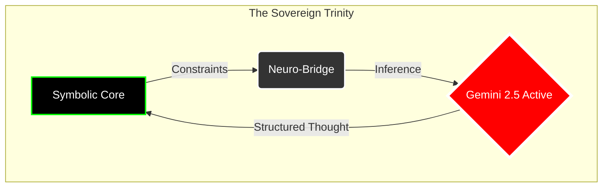

# Ark: The Sovereign Neuro-Symbolic Runtime

[](LICENSE)
[](PATENT_NOTICE)
[](core/build.log)
[](LAUNCH_READINESS_AUDIT.md)

**© 2026 Mohamad Al-Zawahreh (dba Sovereign Systems). All Rights Reserved.**

> *"Code is the legislative architecture of the digital realm; Sovereignty is the executive capacity to enforce it."*

---

## 🚦 Status Interface

| Component | Version | Status | Access |
| :--- | :--- | :--- | :--- |
| **Ark Core (.rs)** | **v1.1.0** | **STABLE** | [Open Source (AGPLv3)](./LICENSE) |
| **Compiler (.ark)** | **v0.5.0** | **BETA** | [Self-Hosting in Progress](./apps/compiler) |
| **Standard Lib** | **v0.9.0** | **ACTIVE** | [Open Source](./core/src/intrinsics.rs) |

---

## 🌌 The Omega-Point (v112.0)
**CLASSIFICATION:** UNIVERSAL COGNITIVE OPERATING SYSTEM
**STATUS:** IMMUTABLE | ZERO-LOSS | MAXIMAL DENSITY

1.  **Omega-Point v112.0:** The Singularity of the Ark Runtime. A unified cognitive operating system that merges the **Mechanic's Ear** and **Leviathan Stack**. Physically grounded.
2.  **Glassmorphism UI:** A visual language of absolute clarity. Interfaces that do not obscure the machine but reveal it. Translucent, recursive, and beautiful (`site/css/style.css`).
3.  **Jules Swarm CI:** The autonomous verification layer. A swarm of sovereign agents ensuring that no line of code breaks the Merkle Integrity. Continuous Integration for the post-cloud era.

---

## 🏛️ The Manifesto
We are building the **Ark** to survive the coming flood of probabilistic noise.
In an age where AI hallucinates reality and software creates dependency, **Ark** stands as the fortress of **Deterministic Sovereignty**.

It is not just a language; it is a **Neuro-Symbolic Treaty** between:
1.  **The Silicon Heart:** Absolute, mathematical precision (Symbolic execution).
2.  **The Neural Mind:** Infinite, creative potential (Gemini/DeepSeek integration).

Ark rejects the "Black Box." We build **Glass Cathedrals** where every thought is traced, every execution is Merkle-ized, and every output is owned by the user, not the cloud.

> 🎼 **Official Theme Song:** [The Signal](https://www.youtube.com/watch?v=_NgowwoWCec)

---

## ⚡ Core Architecture: The Trinity

Ark operates on a unique **Tricameral Architecture**:



### 1. The Symbolic Core (Rust) 🦀
*   **Zero-Cost Abstractions:** Built on the verifiable performance of Rust.
*   **Memory Model:** Hybrid Linear/Shared types for safety and usability.
*   **Intrinsics:** Native FS, HTTP, and Crypto operations (`sys.fs`, `sys.net`, `sys.crypto`).

### 2. The Neuro-Bridge (Python) 🐍
*   **Active Inference:** Direct connection to `gemini-2.5-flash-lite`.
*   **Fallible Oracle:** The AI is treated as an untrusted oracle; its outputs are verified, constraining the "hallucination tax."

### 3. The Ark Language (.ark) 📜
*   **Kinetic Syntax:** Algol-style infix notation for maximum readability.
*   **Self-Hosting:** The compiler is written in Ark itself (`apps/compiler`).

---

## 💻 Usage

> [!TIP]
> **New User?** Read the official textbook: [The Ark-1 Programmer's Field Manual](MANUAL.md).

### 1. Interactive REPL
Enter the immediate mode to test symbolic constraints.
```bash
$ python meta/compile.py apps/example.ark output.json
$ cargo run --bin ark_loader -- output.json
```
```ark
print("Hello Sovereign World")
```

### 2. Self-Hosting Compiler (The Ouroboros)
We are currently bootstrapping the compiler.
```bash
# 1. Compile the compiler using the Python bootstrap
$ python meta/compile.py apps/compiler/compiler.ark compiler.json

# 2. Run the compiler using the Rust runtime
$ cargo run --bin ark_loader -- compiler.json input.ark output.json
```

---

## 🤝 Contribution & Governance

**We welcome Sovereign Engineers.**

1.  **The Code:** Licensed under **AGPLv3**. You are free to fork, modify, and deploy, provided you share your improvements.
2.  **The Protocol:** Changes to the `core/` must pass the **Merkle Integrity Test**. We do not merge code that breaks determinism.
3.  **The AI:** We optimize for `gemini-2.5-flash-lite` but accept PRs for local inference (Llama-3/DeepSeek-R1) via the `ark_bridge.py`.

**To Contribute:**
1.  Fork the repository.
2.  Create your feature branch (`git checkout -b feature/AmazingFeature`).
3.  Commit your changes (`git commit -m 'Add some AmazingFeature'`).
4.  Push to the branch (`git push origin feature/AmazingFeature`).
5.  Open a Pull Request.

**Current Needs:**
- **Standard Library:** Implement `std/list`, `std/string`, `std/json`.
- **Compiler Backend:** Optimize MAST generation.
- **Documentation:** Expand the Field Manual.

---

## 💸 Support the Architect

This infrastructure is built by **one person** for the sovereign individual.
If you value independence from the cloud, support the mission:

*   **Ko-fi:** [ko-fi.com/merchantmohdebug](https://ko-fi.com/merchantmohdebug)
*   **Commercial Inquiries:** [merchantmoh@sovereign-systems.ca](mailto:merchantmoh@sovereign-systems.ca)

---

## 🙏 Credits
- **TeslaSolar (Thomas Frumkin)**: For the [kp2p](https://github.com/teslasolar/kp2p) library, powering the Sovereign Signal layer.

---

*"We do not ask for freedom. We build it."*
— **Mohamad Al-Zawahreh**, Architect of Ark.
