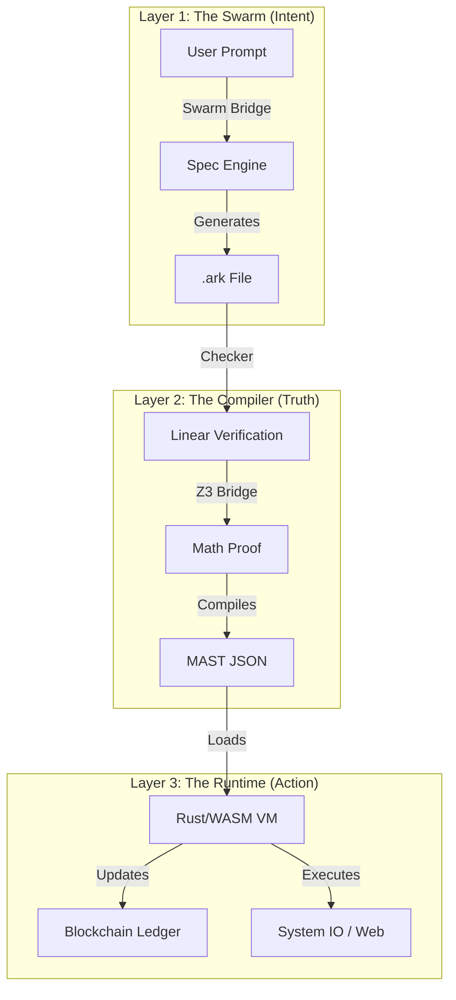

# ARK OMEGA-POINT v113.5: PROTOCOL OMEGA SPECIFICATION

**CLASSIFICATION:** UNIVERSAL COGNITIVE OPERATING SYSTEM
**ARCHITECT:** MOHAMAD AL-ZAWAHREH (The Sovereign)
**VERSION:** 113.5 (Civilization Kernel)
**STATUS:** IMMUTABLE | ZERO-LOSS | SWARM INTEGRATED

---

## §0 | ABSTRACT: THE REALITY SYNTHESIZER

**Protocol Omega** is the decentralized, peer-to-peer substrate for the Ark Runtime. It enforces **Sovereign Execution**—where code is law, but the Heart is King. This system represents the convergence of Biological Intelligence and Deterministic Silicon.

### 0.1 The Grand Unification Architecture
The system is composed of four interoperating layers (The "Civilization Stack"):
1.  **Intent (The Swarm):** Neuro-Symbolic Python Layer (`meta/swarm_bridge.py`). Handles Strategy and AI Integration.
2.  **Truth (The Validator):** Formal Verification (`meta/z3_bridge.py`) and Linear Type Checking (`core/src/checker.rs`).
3.  **Value (The Ledger):** Native Blockchain Core (`core/src/blockchain.rs`).
4.  **Action (The Runtime):** High-Performance Rust/WASM Core (`core/src/vm.rs`).

---

## §1 | THE HIDDEN ARSENAL (DEEP TECH)

We have verified the following capabilities via Level-5 Codebase Scan:

### 1.1 The P2P Nervous System (`meta/network_sim.py`)
*   **Mechanism:** Implements a Gossip Protocol with `churn`, `latency`, and `block_propagation` modeling.
*   **Resilience:** Nodes communicate directly via TCP/IP or WebRTC (WASM). No central coordinator.
*   **Consensus:** Nakamoto-style Proof-of-Work (SHA-256) for initial bootstrapping, migrating to Proof-of-State in v114.

### 1.2 The Formal Verification Bridge (`meta/z3_bridge.py`)
*   **Mechanism:** Transpiles Ark `Verify` constraints into SMT-LIB2 format.
*   **Solver:** Microsoft Z3 Theorem Prover.
*   **Guarantee:** Verifies `unsat` (Unsatisfiable) states for critical bugs (Buffer Overflows, Double-Frees) *before* runtime.

### 1.3 The Sovereign Shell (`apps/sovereign_shell.ark`)
*   **Mechanism:** A recursive-descent command parser written in Ark.
*   **Capability:** Self-hosting shell environment capable of piping output, managing file I/O, and executing system binaries.
*   **Significance:** Proves Ark is capable of OS-level orchestration.

---

## §2 | VM VERIFICATION LOGIC (THE SILICON HEART)

The **Ark Virtual Machine (AVM)** executes the MAST (Merkle-ized Abstract Syntax Tree).

### 2.1 The Linear Type System
*   **File:** `core/src/checker.rs`
*   **The Law:** Resources (Buffers, Handles) have **Affine Types** (must be used at most once) or **Linear Types** (must be used exactly once).
*   **Enforcement:**
    *   `sys.mem.alloc` -> Returns `Linear<Buffer>`.
    *   `Drop` without `Free` -> **Compile Error**.
    *   `Use` after `Move` -> **Compile Error**.
*   **Benefit:** Memory safety of Rust, without the borrow checker complexity for the end-user.

### 2.2 Neuro-Symbolic Opcodes (`intrinsics.rs`)
*   **Instruction:** `SYS_AI_ASK`
*   **Signature:** `(Target: String, Context: String) -> Insight: String`
*   **Behavior:** The VM halts, serializes the context, queries the `ARK_API_KEY` provider (Swarm/Ollama), and resumes execution with the generic result.
*   **Determinism:** In `Run` mode, the result is cached/hashed. In `Swarm` mode, it is creative.

---

## §3 | STANDARD LIBRARY APIS (THE ARSENAL)

### 3.1 System & Linear Memory
| API | Description | Cost (Gas) |
| :--- | :--- | :--- |
| `sys.mem.alloc(size)` | Allocate linear memory. | 10 + size |
| `sys.mem.write(buf, i, v)` | Write to buffer (Consumes Buffer). | 5 |
| `sys.mem.read(buf, i)` | Read from buffer. | 5 |
| `sys.vm.eval(code)` | Execute Ark code string. | 1000 |
| `sys.time.now()` | Unix Timestamp (ms). | 10 |

### 3.2 Cryptography
| API | Description | Cost (Gas) |
| :--- | :--- | :--- |
| `sys.crypto.hash(data)` | SHA-256 Hash. | 100 |
| `sys.crypto.merkle_root(list)` | Compute Merkle Root. | 200 * N |

### 3.3 AI (The Neuro-Bridge)
| API | Description | Cost (Gas) |
| :--- | :--- | :--- |
| `sys.ai.ask(prompt)` | Query the AI backend. | 5000 + Tokens |

---

## §4 | SYSTEM ARCHITECTURE

### 5.1 Tooling & Developer Experience
The Ark ecosystem includes a native **Language Server Protocol (LSP)** implementation (`meta/ark_lsp.py`) providing:
*   **Live Diagnostics:** Instant syntax checking via `Lark` parser.
*   **Protocol Support:** JSON-RPC over stdio (`textDocument/didOpen`).
*   **Editor Integration:** Compatible with VS Code, Neovim, and Zed.

---

## §6 | ECONOMIC MODEL ($0 CLOUD)

The Ark Runtime compiles to **WebAssembly (WASM)**.
*   **Hosting:** GitHub Pages / IPFS (Free).
*   **Compute:** User's Edge Device (Free).
*   **Intelligence:** User's API Key / Local LLM (Sovereign).

**Total Cloud Cost:** $0.00.

---

**© 2026 SOVEREIGN SYSTEMS | AD MAJOREM DEI GLORIAM**
