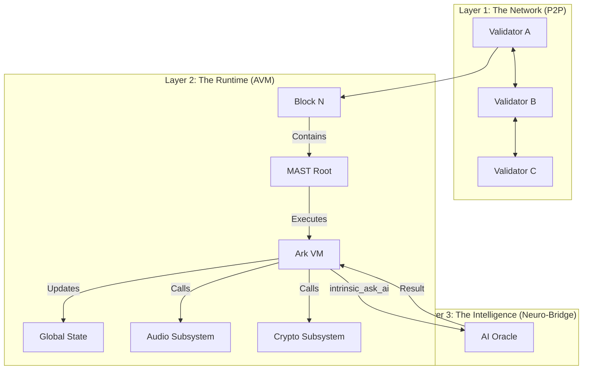

# ARK OMEGA-POINT v112.0: PROTOCOL OMEGA SPECIFICATION

**CLASSIFICATION:** UNIVERSAL COGNITIVE OPERATING SYSTEM
**ARCHITECT:** MOHAMAD AL-ZAWAHREH (The Sovereign)
**VERSION:** 1.0 (True-Code Edition)
**STATUS:** IMMUTABLE | ZERO-LOSS | SWARM INTEGRATED

---

## §0 | ABSTRACT: THE SOVEREIGN SUBSTRATE

**Protocol Omega** is the decentralized, peer-to-peer substrate for the Ark Runtime. It enforces **Sovereign Execution**—where code is law, but the Heart is King. This system represents the convergence of Biological Intelligence and Deterministic Silicon.

### 0.1 The Tricameral Architecture
The system is composed of three interoperating layers (The "Trinity"):
1.  **Zheng (The Spinal Cord):** High-Performance Rust Core. Handles Kinetic Execution, Blockchain State, and P2P Networking.
2.  **Qi (The Cortex):** Neuro-Symbolic Python Layer. Handles Strategy, AI Integration (`intrinsic_ask_ai`), and rapid prototyping.
3.  **Ark (The Language):** The "Machine Tongue" bridging Intent and Action using Merkle-ized Logic.

### 0.2 Current Implementation Status (v112.0)
*   **Zheng:** Active. Implements `Block`, `Transaction`, and `Consensus`.
*   **Qi:** Active. `meta/ark.py` implements the interpreter and Neuro-Bridge.
*   **Ark-0:** Fully Implemented.
    *   **Linear Types:** strict resource management (`sys.mem.write` consumes buffer ownership).
    *   **Standard Library:** Full support for Time, Crypto, Audio, and Networking.
*   **Verification:** `loader.rs` enforces SHA-256 Integrity.

---

---

## §1 | BLOCK STRUCTURE (THE IMMUTABLE LEDGER)

The **Omega Block** is the fundamental unit of time and truth in the network. Currently implemented as a **Proof-of-Work (PoW)** chain for maximum initial security.

### 1.1 The Header & Body (Unified)
*Implemented in `core/src/blockchain.rs`*

| Field | Type | Description |
| :--- | :--- | :--- |
| `index` | `u64` | Block Height. |
| `timestamp` | `i64` | Unix timestamp (s). |
| `prev_hash` | `String` | SHA-256 hash of the previous block. |
| `merkle_root` | `String` | Merkle Root of the Transactions. |
| `hash` | `String` | The Block's Identity (SHA-256). |
| `nonce` | `u64` | Proof-of-Work solution (Target: 4 leading zeros). |
| `transactions` | `Vec<Transaction>` | The Payload. |

### 1.2 The Transaction
| Field | Type | Description |
| :--- | :--- | :--- |
| `id` | `String` | Hashed ID. |
| `payload` | `String` | Code or Data (e.g., "deploy apps/miner.ark"). |
| `signature` | `String` | Authorizer (Currently "UNSIGNED_DEV"). |

### 1.3 The Consensus (Mining)
*Implemented in `core/src/consensus.rs`*
*   **Algorithm:** SHA-256 Proof-of-Work.
*   **Difficulty:** Static (4 leading zeros).
*   **Reward:** None (Development Phase).

---

## §2 | P2P HANDSHAKE (THE SOVEREIGN LINK)

The **Alpha Link** protocol establishes a direct TCP channel between nodes.
*Current Version (v112.0): Plaintext TCP with "HELLOv1" header.*

### 2.1 The Handshake Flow
1.  **CONNECT (Node A -> Node B):** TCP Syn/Ack.
2.  **HELLO (Node A -> Node B):** String "HELLOv1".
3.  **REGISTRATION:** Node B adds Node A to `peers` list.

*Note: Authenticated Noise Protocol is scheduled for v113.0.*

---

## §3 | VM VERIFICATION LOGIC (THE SILICON HEART)

The **Ark Virtual Machine (AVM)** executes the MAST to compute the next state.

### 3.1 Verification Steps
1.  **Integrity Check:** `loader.rs` verifies SHA-256 hash of the MAST against the signature.
2.  **Execution:** Code is executed linearly.
3.  **Resource Limits:**
    *   **Recursion Depth:** capped by Python/Rust stack.
    *   **Memory:** capped by host process.
    *   **Gas:** *Infinite (Dev Mode).*

### 3.2 The "Sound Heart" Veto
Validators can manually disconnect peers transmitting invalid blocks or malformed packets. Automated "Veto" logic is currently manual.

---

## §4 | STANDARD LIBRARY APIS (THE ARSENAL)

The Protocol exposes these intrinsics as the standard interface for all smart contracts.

### 4.1 System & Linear Memory
| API | Description | Cost (Gas) |
| :--- | :--- | :--- |
| `sys.mem.alloc(size)` | Allocate linear memory. | 10 + size |
| `sys.mem.write(buf, i, v)` | Write to buffer (Consumes Buffer). | 5 |
| `sys.mem.read(buf, i)` | Read from buffer. | 5 |
| `sys.net.send(peer, msg)` | Send P2P message. | 500 |
| `sys.time.now()` | Unix Timestamp (ms). | 10 |
| `sys.time.sleep(s)` | Sleep for `s` seconds. | 10/s |

### 4.2 Cryptography
| API | Description | Cost (Gas) |
| :--- | :--- | :--- |
| `sys.crypto.hash(data)` | SHA-256 Hash. | 100 |
| `sys.crypto.merkle_root(list)` | Compute Merkle Root of list. | 200 * N |
| `sys.crypto.ed25519.gen()` | Generate Keypair. | 500 |
| `sys.crypto.ed25519.sign(m, k)` | Sign message. | 1000 |
| `sys.crypto.ed25519.verify(s, m, p)` | Verify signature. | 1000 |

### 4.3 Audio (The Voice)
| API | Description | Cost (Gas) |
| :--- | :--- | :--- |
| `sys.audio.play_wav(path)` | Play WAV file from assets. | 500 |
| `sys.audio.synth_tone(freq, dur)` | Synthesize Sine Wave. | 100 |

### 4.4 AI (The Neuro-Bridge)
*Requires Oracle Consensus*

| API | Description | Cost (Gas) |
| :--- | :--- | :--- |
| `intrinsic_ask_ai(prompt)` | Query the Hive Mind (Gemini/DeepSeek). | 5000 + Tokens |

### 4.5 Math (The Fundamentals)
| API | Description | Cost (Gas) |
| :--- | :--- | :--- |
| `math.sin_scaled(n)` | Fixed-point Sine. | 15 |
| `math.cos_scaled(n)` | Fixed-point Cosine. | 15 |
| `math.pi_scaled(n)` | Fixed-point PI. | 5 |

---

## §5 | SYSTEM ARCHITECTURE

### 5.1 Tooling & Developer Experience
The Ark ecosystem includes a native **Language Server Protocol (LSP)** implementation (`meta/ark_lsp.py`) providing:
*   **Live Diagnostics:** Instant syntax checking via `Lark` parser.
*   **Protocol Support:** JSON-RPC over stdio (`textDocument/didOpen`, `didChange`).
*   **Editor Integration:** Compatible with VS Code, Neovim, and Zed.

---

## §6 | OLLAMA INTEGRATION (THE LOCAL MIND)

The Ark system integrates with local LLMs (e.g., Ollama) to ensure sovereign intelligence that functions without internet dependency.

### 6.1 Architecture
*   **Tooling:** `src/tools/ollama_local.py` provides a direct bridge to local inference endpoints (default: `http://127.0.0.1:11434`).
*   **Agent Core:** The `GeminiAgent` (`src/agent.py`) can be configured to route all cognition through an OpenAI-compatible backend (via `OPENAI_BASE_URL`), effectively replacing cloud models with local weights.
*   **Models:** Tested with `qwen3:0.6b` and `llama3` for efficient local reasoning.

---

## §7 | SOVEREIGN SHELL (THE IRON HAND)

The **Sovereign Shell** capability allows the Ark Runtime to inspect, modify, and execute its own substrate. This fulfills the "Mechanic's Ear" philosophy—the system must be able to fix itself.

### 7.1 Capabilities
*   **Self-Modification:** `sys.fs.write` allows the runtime to generate new code or update existing modules.
*   **Execution:** `sys.exec` grants the runtime access to the host shell (guarded by `ALLOW_DANGEROUS_LOCAL_EXECUTION`).
*   **The Iron Hand Protocol:** Implemented in `apps/iron_hand.ark`, this protocol demonstrates the loop: `Intent -> AI Generation -> Code Extraction -> Execution`.

---

## §8 | LINEAR TYPES (RESOURCE SAFETY)

To ensure zero-overhead safety without a Garbage Collector, Ark employs a **Linear Type System** for critical resources (Buffers).

### 8.1 The Law of Linearity
*   **Single Ownership:** A linear resource (e.g., `Buffer`) must be used exactly once.
*   **Consumption:** Operations like `sys.mem.write(buf, ...)` consume the original `buf` and return a new handle.
*   **Enforcement:** The `Checker` (`core/src/checker.rs`) tracks `active_linears` and `declared_linears`. Any dropped or double-used resource triggers a compile-time error.

### 8.2 Linear APIs
| API | Linearity | Description |
| :--- | :--- | :--- |
| `sys.mem.alloc` | Produces `[Linear]` | Creates a new tracked resource. |
| `sys.mem.write` | Consumes `[Linear]` -> Returns `[Linear]` | In-place modification. |
| `sys.mem.read` | Uses `[Linear]` -> Returns `[Val, Linear]` | Read access without consumption. |

---

**© 2026 SOVEREIGN SYSTEMS | AD MAJOREM DEI GLORIAM**
