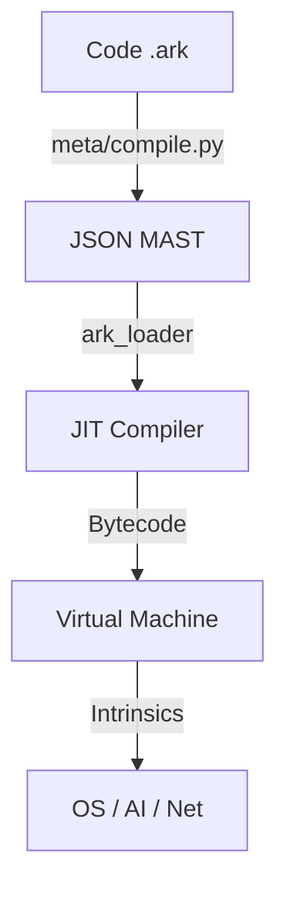

# The Ark-1 Programmer's Field Manual

**Version:** Omega-Point v112.0
**Architect:** Mohamad Al-Zawahreh (Sovereign Systems)
**Status:** ACTIVE / SOVEREIGN

---

## 🌌 Introduction

**Ark** is a Neuro-Symbolic programming language designed for the Sovereign Individual. It offers a **Dual-Runtime Architecture**:
1.  **The Neuro-Bridge (Python):** Rapid prototyping, direct AI integration, and dynamic behavior.
2.  **The Silicon Heart (Rust):** High-performance, memory-safe execution via the Ark Virtual Machine (AVM).

### The Philosophy
1.  **Kinetic Syntax:** Code flows from Left to Right. Assignments are explicit actions (`:=`).
2.  **Safety via Values:** Structures are passed by value (cloned) by default in the VM, preventing shared mutable state issues.
3.  **Neuro-Symbolic:** The runtime has direct access to AI models (`intrinsic_ask_ai`), allowing code to "think" while remaining verifiable.

---

## 🛠️ Installation & Setup

Ark is distributed as a source-available sovereign stack.

### Prerequisites
1.  **Rust**: [Install Rust](https://rustup.rs/) (Required for the VM).
2.  **Python 3.10+**: Required for the Bootstrap Compiler and Interpreter.
3.  **Dependencies**:
    ```bash
    pip install lark
    ```

### Environment Variables
To unlock the full power of Ark, you must configure your environment:

| Variable | Description | Required For |
| :--- | :--- | :--- |
| `GOOGLE_API_KEY` | API Key for Gemini 2.0 Flash. | `intrinsic_ask_ai` |
| `ALLOW_DANGEROUS_LOCAL_EXECUTION` | Set to `"true"` to enable `sys.exec` and file writes. | File I/O, Shell Commands |

### Cloning & Building
```bash
git clone https://github.com/your-repo/ark-0-zheng.git
cd ark-0-zheng
```

---

## ⚡ Execution Modes

### 1. The Interpreter (Neuro-Bridge)
Run `.ark` files directly. Best for development and AI workflows.
```bash
python3 meta/ark.py run apps/hello.ark
```

### 2. The Compiler (Silicon Heart)
Compile to JSON MAST (Merkle-ized AST) and execute on the Rust VM.
```bash
# 1. Compile
python3 meta/compile.py apps/hello.ark hello.json

# 2. Run
cd core
cargo run --bin ark_loader -- ../hello.json
```

---

## ⚡ Basic Syntax

### Variables
Ark uses `:=` for assignment.

```ark
x := 10
name := "Sovereign"
is_active := true
```

### Primitives
- **Integer**: 64-bit signed integers (`10`, `-5`).
- **String**: UTF-8 strings (`"Hello"`).
- **Boolean**: `true` or `false`.
- **Unit**: The empty value (returned by void functions).

### Arithmetic & Logic
Standard operators work as expected:
```ark
sum := 10 + 20
diff := 50 - sum
prod := 2 * 3
quot := 10 / 2
is_equal := 10 == 10
check := (10 > 5) && (2 < 4)
```

---

## 🔄 Control Flow

### If / Else
```ark
power := 9001
if power > 9000 {
    print("It's over 9000!")
} else {
    print("Weak.")
}
```

### While Loop
```ark
count := 5
while count > 0 {
    print(count)
    count := count - 1
}
```

---

## 📦 Ownership & Linear Semantics

Ark uses **Pass-by-Value** (Copy) semantics in the VM for most types, but **Linear Semantics** for Buffers and system resources.

### Buffers (Linear Types)
Buffers are raw byte arrays. They must be handled linearly (consumed and returned) to ensure safety without Garbage Collection.

```ark
// Alloc
buf := sys.mem.alloc(1024)

// Write (Consumes 'buf', returns new 'buf')
buf := sys.mem.write(buf, 0, 255)

// Read (Consumes 'buf', returns [value, buf])
res := sys.mem.read(buf, 0)
val := res[0]
buf := res[1] // Re-assign buffer to keep using it
```

### Structs & Lists
Structs and Lists are currently **Copy-on-Write** or **Clone-on-Pass** in the VM.
```ark
s := { x: 10 }
s2 := s
// 's2' is a clone. Modifying 's2' does NOT affect 's'.
```

---

## 🔧 Functions

Define functions with `func`. Arguments are passed by value.

```ark
func add(a, b) {
    return a + b
}

res := add(10, 20)
```

**Recursion:** Supported (e.g. Factorial).

---

## 🧠 Intrinsics (Standard Library)

Ark provides powerful built-in functions.

### Core
| Function | Description |
| :--- | :--- |
| `print(...)` | Prints values to stdout. |
| `sys.len(seq)` | Returns `[length, seq]`. |

### System (Requires Security Flags)
| Function | Description |
| :--- | :--- |
| `sys.exec(cmd)` | Executes a shell command (Security Warning!). |
| `sys.fs.write(path, data)` | Writes string to file. |
| `sys.fs.read(path)` | Reads string from file. |

### AI & Neuro-Symbolic
| Function | Description |
| :--- | :--- |
| `intrinsic_ask_ai(prompt)` | Queries Gemini AI (requires `GOOGLE_API_KEY`). |

### Math & Crypto
| Function | Description |
| :--- | :--- |
| `math.pow(base, exp)` | Power function. |
| `math.sqrt(n)` | Square root. |
| `sys.crypto.hash(str)` | SHA-256 Hash. |
| `sys.crypto.merkle_root(list)` | Computes Merkle Root of a list of strings. |

### Memory (Linear)
| Function | Description |
| :--- | :--- |
| `sys.mem.alloc(size)` | Allocates a byte buffer. |
| `sys.mem.write(buf, idx, val)` | Writes byte to buffer (Linear). |
| `sys.mem.read(buf, idx)` | Reads byte from buffer (Linear). |

---

## 🏛️ Architecture



---

## 🎓 Complete Example

```ark
print("Starting Ark System...")

// 1. Define Data
config := {
    version: 1,
    mode: "secure"
}

// 2. Logic
if config.mode == "secure" {
    print("Security Active")
}

// 3. Modification
config.version := 2
print("Upgraded to Version:")
print(config)

// 4. Function Call
func double(n) {
    return n * 2
}

result := double(10)
print(result)

// 5. AI Integration
prompt := "What is the meaning of life?"
// answer := intrinsic_ask_ai(prompt) // Uncomment if API Key is set
// print(answer)
```

---

**© 2026 Sovereign Systems**
