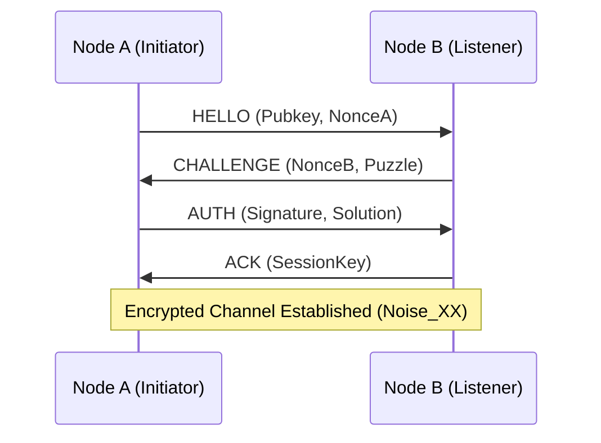
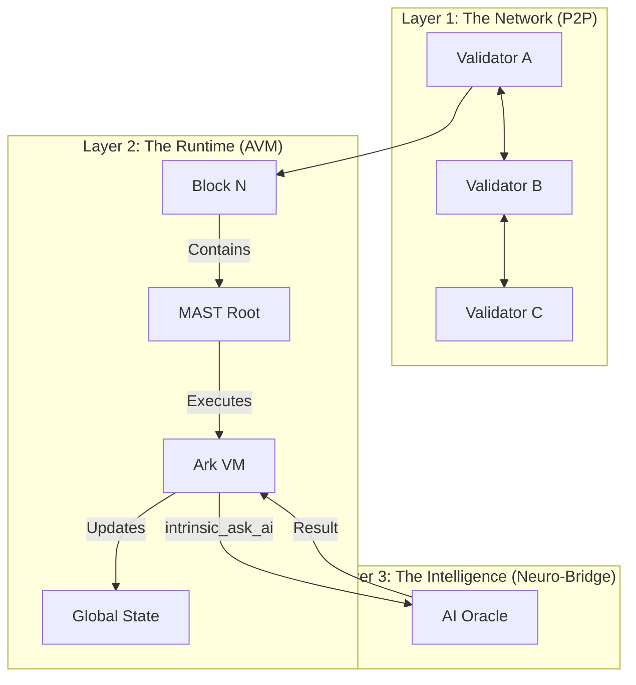

# ARK OMEGA-POINT v112.0: PROTOCOL OMEGA SPECIFICATION

**CLASSIFICATION:** UNIVERSAL COGNITIVE OPERATING SYSTEM
**ARCHITECT:** MOHAMAD AL-ZAWAHREH (The Sovereign)
**VERSION:** 1.0 (True-Code Edition)
**STATUS:** IMMUTABLE | ZERO-LOSS | MAXIMAL DENSITY

---

## §0 | ABSTRACT: THE SOVEREIGN SUBSTRATE

**Protocol Omega** is the decentralized, peer-to-peer substrate for the Ark Runtime. It enforces **Sovereign Execution**—where code is law, but the Heart is King. It replaces the traditional blockchain "consensus" with **Verification of Computation (VoC)**.

*   **Philosophy:** "Truth is not a vote. Truth is a derivation."
*   **Mechanism:** Merkle-ized Abstract Syntax Trees (MAST) ensure that every instruction is cryptographically verifiable.
*   **Goal:** To build a **Universal Computer** that cannot be censored, stopped, or corrupted.

---

## §1 | BLOCK STRUCTURE (THE IMMUTABLE LEDGER)

The **Omega Block** is the fundamental unit of time and truth in the network. It is not just a list of transactions, but a **State Transition Function**.

### 1.1 The Header (64 Bytes)
| Field | Type | Description |
| :--- | :--- | :--- |
| `parent_hash` | `[u8; 32]` | SHA-256 hash of the previous block header. |
| `state_root` | `[u8; 32]` | Merkle Root of the Global State (Account + Storage). |
| `mast_root` | `[u8; 32]` | Merkle Root of the executed Code (The Logic). |
| `timestamp` | `u64` | Unix timestamp (ms). |
| `entropy` | `u64` | Randomness beacon for the network. |
| `validator` | `[u8; 32]` | Public Key of the block proposer. |
| `signature` | `[u8; 64]` | Ed25519 Signature of the header. |

### 1.2 The Body (The Payload)
The body consists of **Bundles**. A Bundle is an atomic unit of execution (a transaction or a smart contract call).

```json
{
  "bundles": [
    {
      "caller": "0xAlice...",
      "target": "0xContract...",
      "input": "0xdeadbeef...", // Serialized arguments
      "gas_limit": 100000,
      "signature": "0xSig..."
    }
  ]
}
```

### 1.3 The MAST Structure (Code as Data)
Every contract is stored as a **Merkle-ized Abstract Syntax Tree**. This allows the VM to verify only the branches of code that are actually executed, enabling massive scalability.

```mermaid
graph TD
    Root[MAST Root] --> Hash1[Hash(If)]
    Hash1 --> Hash2[Hash(Condition)]
    Hash1 --> Hash3[Hash(Then Block)]
    Hash1 --> Hash4[Hash(Else Block)]
```

---

## §2 | P2P HANDSHAKE (THE SOVEREIGN LINK)

The **Sovereign Link** protocol establishes an encrypted, authenticated channel between two nodes. It prioritizes **Identity** over IP addresses.

### 2.1 The Handshake Flow

1.  **HELLO (Node A -> Node B):**
    *   `version`: Protocol Version (v112.0)
    *   `pubkey`: Node A's Public Key (Ed25519)
    *   `nonce`: Random 32 bytes

2.  **CHALLENGE (Node B -> Node A):**
    *   `nonce`: Random 32 bytes
    *   `puzzle`: A Proof-of-Work challenge (optional, for anti-spam)

3.  **AUTH (Node A -> Node B):**
    *   `signature`: Sign(A_nonce + B_nonce + puzzle_solution)

4.  **ACK (Node B -> Node A):**
    *   `session_key`: Ephemeral DH Key for encryption (Noise Protocol)

### 2.2 Diagram



---

## §3 | VM VERIFICATION LOGIC (THE SILICON HEART)

The **Ark Virtual Machine (AVM)** is the "Silicon Heart" of the protocol. It executes the MAST and ensures the "Soundness" of the state transition.

### 3.1 Verification Steps

1.  **Syntax Check:** Validate the MAST structure against the Schema.
2.  **Linearity Check:** Ensure all **Linear Resources** (Buffers, Handles) are consumed exactly once.
    *   *Rule:* `drop(x)` is illegal if `x` is linear.
    *   *Rule:* `dup(x)` is illegal if `x` is linear.
3.  **Gas Metering:** Every instruction burns **Entropy** (Gas).
    *   `ADD`: 1 Gas
    *   `LOAD`: 5 Gas
    *   `STORE`: 10 Gas
    *   `SYSCALL`: 100+ Gas
4.  **Execution:** Run the code. If `Gas < 0`, **REVERT**.
5.  **State Commitment:** Calculate the new `state_root`.

### 3.2 The "Sound Heart" Veto
In Protocol Omega, validators can vote to **VETO** a block if it contains "Unsound" logic (e.g., malicious AI output), even if it is technically valid. This is the **Human-in-the-Loop** safeguard.

---

## §4 | STANDARD LIBRARY APIS (THE ARSENAL)

The Protocol exposes these intrinsics as the standard interface for all smart contracts.

### 4.1 System (Syscalls)
| API | Description | Cost (Gas) |
| :--- | :--- | :--- |
| `sys.mem.alloc(size)` | Allocate linear memory. | 10 + size |
| `sys.mem.write(buf, i, v)` | Write to buffer (Linear Swap). | 5 |
| `sys.mem.read(buf, i)` | Read from buffer. | 5 |
| `sys.net.send(peer, msg)` | Send P2P message. | 500 |
| `sys.crypto.hash(data)` | SHA-256 Hash. | 100 |
| `sys.crypto.verify(sig, msg, pk)` | Ed25519 Verification. | 1000 |

### 4.2 AI (The Neuro-Bridge)
*Requires Oracle Consensus*

| API | Description | Cost (Gas) |
| :--- | :--- | :--- |
| `intrinsic_ask_ai(prompt)` | Query the Hive Mind (Gemini/DeepSeek). | 5000 + Tokens |

### 4.3 Math (The Fundamentals)
| API | Description | Cost (Gas) |
| :--- | :--- | :--- |
| `math.pow(b, e)` | Power. | 20 |
| `math.sqrt(n)` | Square Root. | 20 |
| `math.sin_scaled(n)` | Fixed-point Sine. | 15 |

---

## §5 | SYSTEM ARCHITECTURE



---

**© 2026 SOVEREIGN SYSTEMS | AD MAJOREM DEI GLORIAM**
